# Projet Analyse de données
BRUSTOLIN Lucas, TREMBLEAU Thibault & BOYER Alexis

## Préambule
Rendu du projet de l'UE d'analyse de données de l'université Lyon 1. L'objectif est de fournir une visualisation de données avec les pricipaux indicateur en utilisant la librairie Python Dash.

## Donneées
Médailles de jeux olympique d'été et d'hiver entre 1896 et 2016 ([lien](https://www.kaggle.com/datasets/heesoo37/120-years-of-olympic-history-athletes-and-results/data))
L'ensemble des données se trouvent aussi dans le fichier data.zip et dans les fichier data\athlete_events.csv et data\noc_regions.csv

### Type de données
Les données sont les colonnes suivantes : "ID","Name","Sex","Age","Height","Weight","Team","NOC","Games","Year","Season","City","Sport","Event","Medal"
```
    ID - Unique number for each athlete
    Name - Athlete's name
    Sex - M or F
    Age - Integer
    Height - In centimeters
    Weight - In kilograms
    Team - Team name
    NOC - National Olympic Committee 3-letter code
    Games - Year and season
    Year - Integer
    Season - Summer or Winter
    City - Host city
    Sport - Sport
    Event - Event
    Medal - Gold, Silver, Bronze, or NA
```

Les données Name,Sex,Team,NOC,Games,Season,City,Sport,Event et Medal sont nominal.
Les données ID,Age,Height,Weight et Year sont ordinales

### Source
Les données ont été éxtraite du site [https://www.sports-reference.com/](https://www.sports-reference.com/).
Ce site est référencé par 135 liens éxterne, est composé de profésinel et financé par des grands groupe de sport.
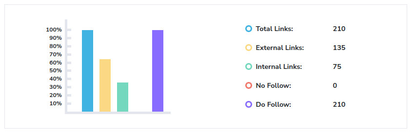

## Fonctionnement de l'application

Pour pouvoir se lancer l'application a besoin de python 3.11 avec les modules Plotly (lien), Dash (lien), Numpy (lien), Networkx (lien) et Sklearn (lien) installés.
Les commandes suivantes permettent de lancé l'application
```
python app.py
```
ou
```
python3 app.py
```
si python 3 et 2.7 coexiste sur la machine

l'application se lance si tout se passe comme prévu sur `localhost:8050`
NB : l'application peut prendre un certains temps pour se lancer à cause des caulculs important notament ceux sur les graphs

# Overview

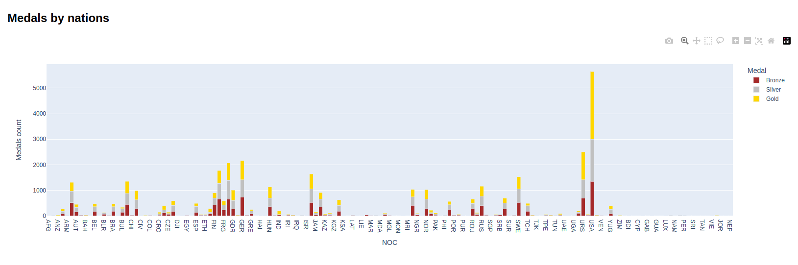

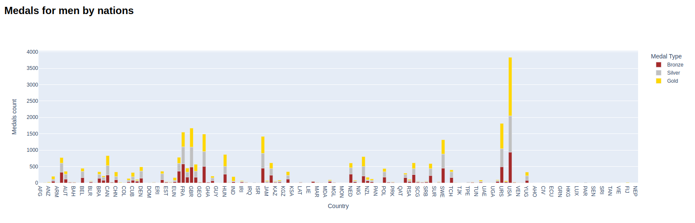

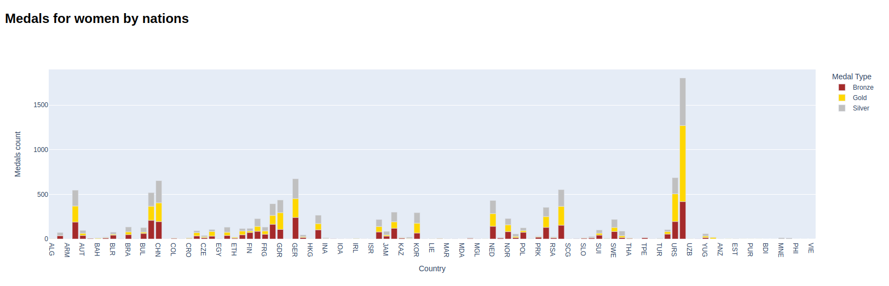

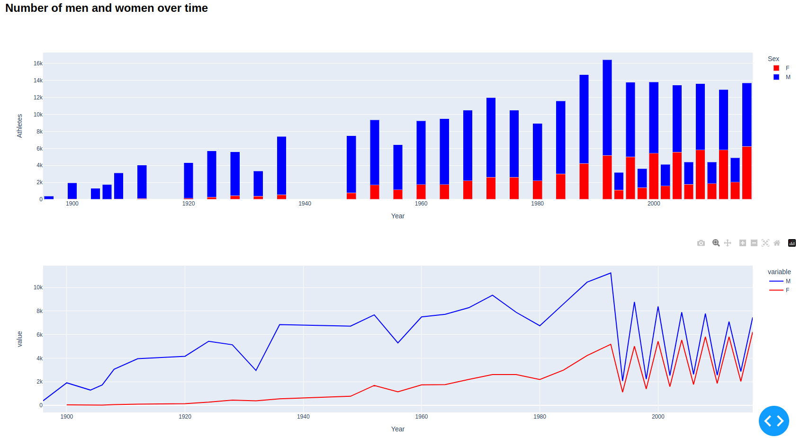

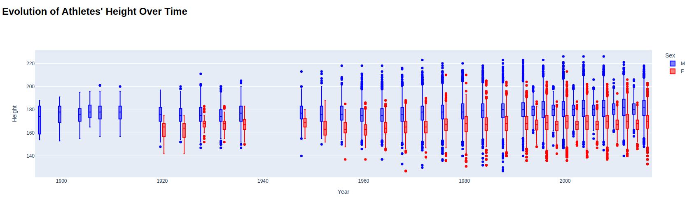

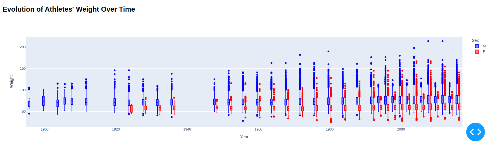

# Cluster

## Difference entre athlétes homme et femme
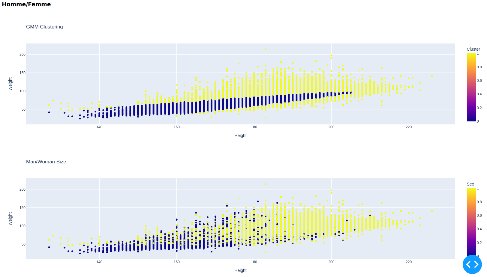

Sur le premier graphe, on voit la taille et le poids des athlètes, ainsi que leurs sexes (rose pour les femmes et bleu pour les hommes). Sur le deuxième graphe, on voit que la division de la population entre 2 groupes.
À l'aide de l'algorithme Gaussian Mixture, on peut voir que deux groupes se dégagent, le groupe des athlètes petits et pas très lourds et celui des grands et lourds. Le premier est essentiellement constitué de femmes et d'athlètes qui pratiquent des sports dans lesquels la taille n'est pas un avantage (gymnastique, tennis de table, etc.) et dans l'autre, il s'agit essentiellement des hommes et des athlètes qui pratiquent un sport dans lequel le poids et la taille est un avantage. (basket, haltérophilie, etc.)

## Difference entre pays  
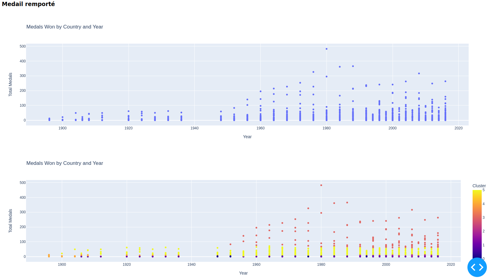
Sur le premier graphe, on voit le nombre de médailles gagné par pays en fonction des années.
Sur le deuxième, on voit la partition en 4 clusters grâce à l'algorithme Gaussian Mixture. On peut observer que les pays sont séparés entre ceux qui gagnent tout le temps, ce qui gagne un peu, ceux qui ne gagnent pas et depuis 1980 (essentiellement des anciens pays de l'URSS) et ceux qui ne gagne pas depuis toujours.

Pour chaque détection de cluster, on utilise l'algorithme Gaussian Mixture, car les clusters que l'on cherche ne sont pas sphériques et on connaît déjà le nombre de communautés que l'on attend.
Pour chaque cluster, nous avons centré et réduit les valeurs avant de leur appliquer l'algorithme.

# Network

## Construction du graph
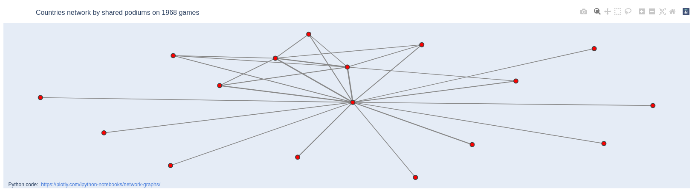
Pour construire le graphe, on lie chaque pays avec les pays avec lesquels ils ont partagé un podium au jeu de l'année 1968, plus ils ont de podium plus les liens sont forts. Dans le graphe, le poids des liens est représenté avec l'épaisseur du trait.
Seuls les pays ayant reçu plus de 50 médailles sont conserver afin de rendre le graphe plus claire.

## Analyse du degré
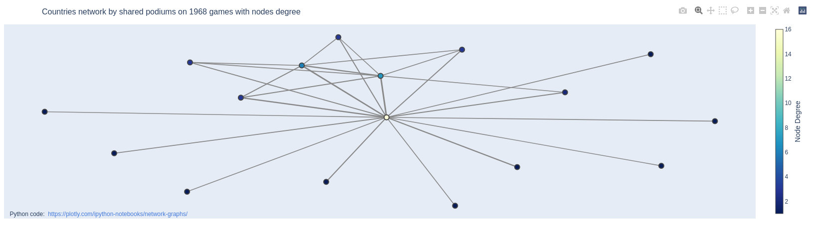
Ici, on voit le même graphe que précédemment, mais avec la couler des points représentant leur dégrées. On voit que l'URSS à partager des podium avec plein de pays diffèrent, encore plus que les USA. C'est dû au fait que l'URSS est forte à la fois au JO d'été et d'hiver là où les USA sont moins bons en hiver.

## Analyse de centralité
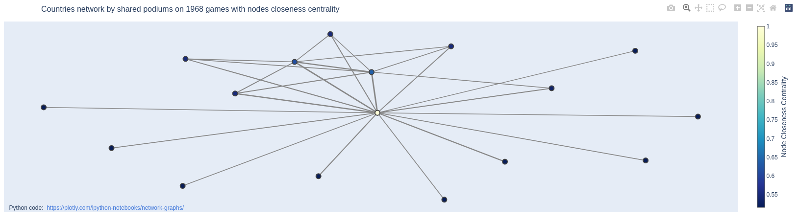
Ici, la centralité a été représentée par la couleur du point.
On retrouve l'importance de l'URSS. Ici le fait que l'URSS gagne les deux Jeux olympiques devient plus important

## Analyse par communauté
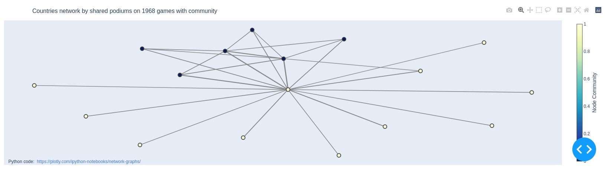
Ici, les pays sont séparés en communauté par la méthode de Louvain et on voit clairement la séparation des pays qui ne gagnent qu'en hiver (Norvège, Suède, etc.) et ceux qui ne gagnent que ceux d'été (Italie, Espagne, Allemagne de l'Ouest)